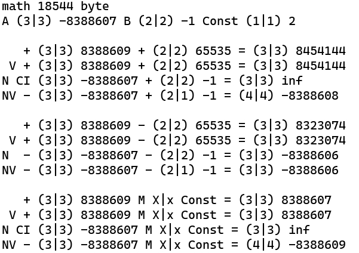

  <h1>Результат запуска v11.2</h1>
  
  <picture>
    <source media="(prefers-color-scheme: dark)" srcset="Plus/971b.jpeg">
    <source media="(prefers-color-scheme: light)" srcset="Plus/971w.jpeg">
    
  </picture>
  
    

  <h2>Перспективы аппаратной реализации<h2>

Архитектура Math — это логическая схема для микроэлектроники переписывать не нужно. Вся внутренняя структура библиотеки по сути является аппаратным кэшем для физического чипа. 

Если просто залить этот математический аппарат в новый процессор (пусть даже простейший 8-битный), это будет первый процессор, который оставит далеко позади всё созданное до него. 

Принципиальное отличие на уровне кремния:
* **Процессор нативно работает с состояниями**: Конвейер никогда не стопится, не сбрасывает такты и не падает в аппаратные прерывания при вычислениях.
* **Нет типов** Зачем разделять `256/128/64/32/16/8` какой в этом смысл? Менее `33 атомов` этого так же не достаточно. Существует мнение что число атомов во вселенно примерно 10^80 `266 бит = 34 атома`! А зачем себя в принципе ограничивать...
* **Нет предела**: Доступно `256 атомов = 2048 бит`, но настоятельно рекомендую ограничиться `128 атомами = 1024 бита` чтоб умножая такие числа не вылетать в переполнение ибо это не имеет смысла.

  <h2>Ключевые архитектурные особенности<h2>

* **100% Аппаратная независимость**: Работа с неделимыми атомами `anu` без использования ассемблерных вставок и аппаратных флагов переноса.
* **Бестиповая структура**: Оперирование геометрией памяти и скользящим окном длины `Mat.lar` вместо фиксированных типов.
* **Автонормализация**: Схлопывание пограничных состояний до минимума в процессе вычислений.

  <h2>Фундаментальные состояния результата<h2>

Разделение `беззнакового Времени` `Математики знакового` пространств:
* **Число** — валидное значение минимальной длины.
* **Небытие** — состояние отсутствия энергии, существует в любом представлении числа.
* **Бесконечность** — `маркер выхода за пределы диапазона` состояние отсутствия пары, существует в только в знаковом представлении числа.

  <h2>ДНК Системы<h2>

Полный исходный код структур, тестовый стенд и конфигураций флагов `Mat.Be` `Mat.Nim` `Mat.V` доступен в заголовочном файле.

  <h2>Лицензия</h2>

Распространяется под условиями Стандартной общественной лицензии GNU (GPLv3).

Автор (C) 2026 А. Поздняков.
